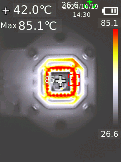

# REF80 Votlage Reference Basic Test Board

REF80 is a Temperature-Controlled Buried Zener Voltage Reference with 0.05ppm/°C Drift and < 1ppm Stability.

See https://www.ti.com/product/REF80

This project is a basic breakout board to be able to test REF80.

OSH Park project available for order: https://oshpark.com/shared_projects/kTTHxNFD

## Finished Board

## Thermal Camera Captures

### Top

### Bottom

### First 2 Hours Vref at 115C

